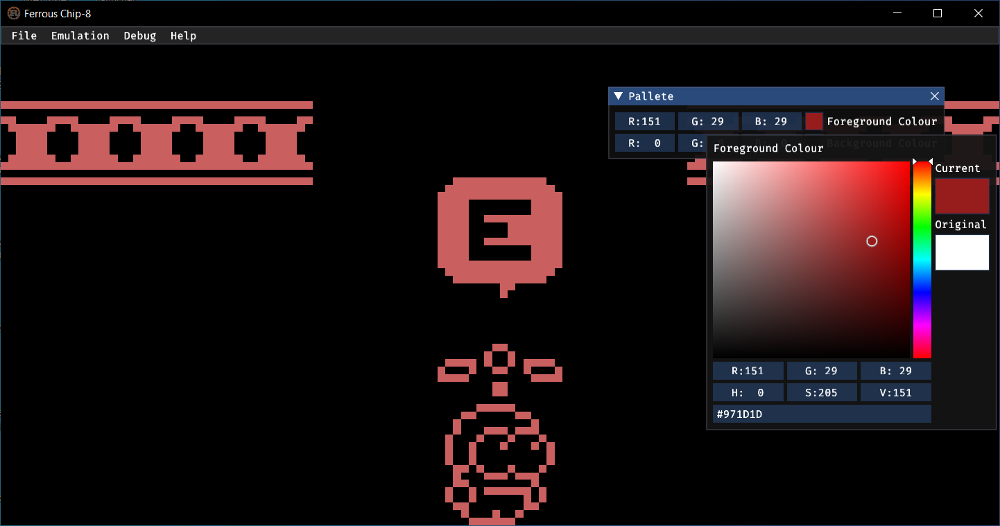
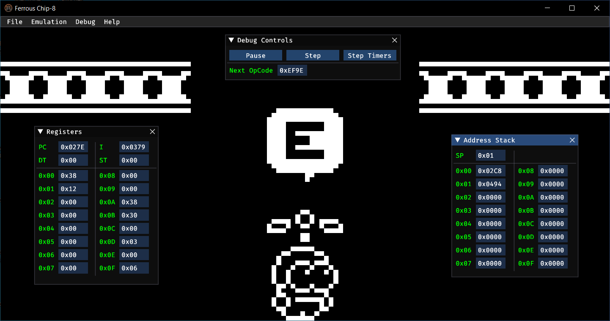

# Ferrous

Ferrous is a (super) Chip-8 interpreter written in Rust.

 &nbsp;
 &nbsp;

## Installation

Ferrous requires that you have the _latest_ stable Rust compiler, and also have GTK and ALSA development
libraries installed on Linux systems.

After ensuring the above, clone the repository and run `cargo build --release`. The binary will be created
in the directory `./target/release`. You can then copy the binary to any location of your choosing.

**Note: There are prebuilt binaries available for Windows and Linux platforms in the
releases section.**

## Usage

Execute Ferrous' binary, and you will be up and running.

```ascii
./ferrous-native
```

## Features

Ferrous is certainly not perfect, but it supports the following features:

1. Tweak the behaviour of some ambiguous for maximum compatibility.
2. Accurate Chip-8 and Super Chip-8 emulation (interpretation?)
3. Rich native frontend with support for debugging and more.
4. Extremely simple and easy to understand core logic implementation.

## License

Ferrous is licensed under the terms of the Apache 2.0 license.
