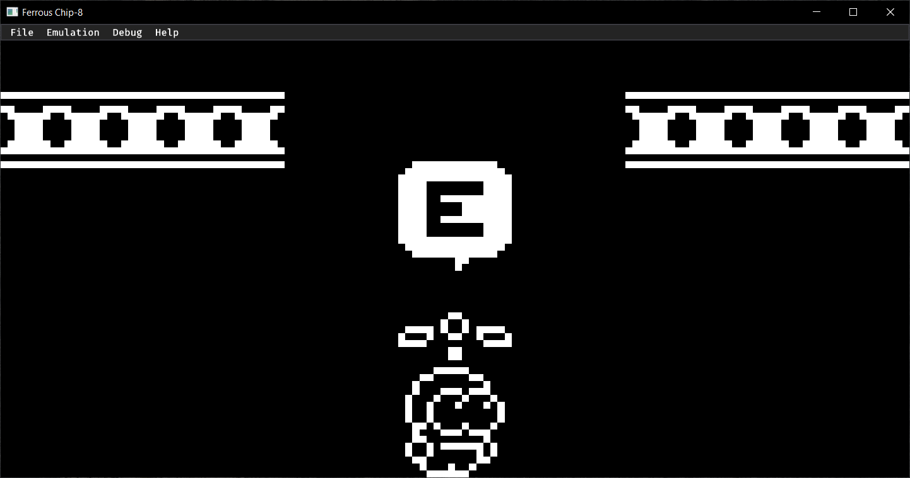
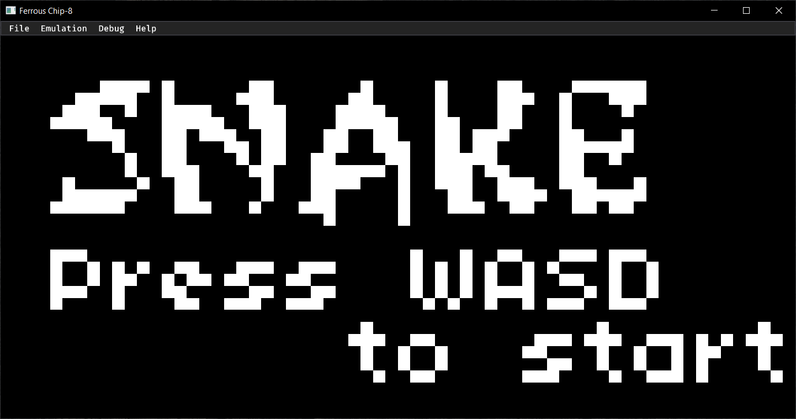

# Ferrous

Ferrous is a (super) Chip-8 interpreter written in Rust.

 &nbsp;
 &nbsp;

## Installation

Ferrous requires that you have the _latest_ stable Rust compiler, and also have GTK and ALSA development
libraries installed on Linux systems.

After ensuring the above, clone the repository and run `cargo build --release`. The binary will be created
in the directory `./target/release`. You can then copy the binary to any location of your choosing.

**Note: There are prebuilt binaries available for Windows and Linux platforms in the
releases section.**

## Usage

Execute Ferrous' binary, and you will be up and running.

```ascii
./ferrous-native
```

## Features

Ferrous is certainly not perfect, but it supports the following features:

- Tweak the behaviour of some ambiguous instructions for maximum compatibility.
- Accurate Chip-8 and Super Chip-8 emulation (interpretation?)
- Rich native frontend with support for debugging and more.
- Extremely simple and easy to understand core logic implementation.

## Resources

### Documentation and References

1. [CowGod's Chip-8 Technical Reference](http://devernay.free.fr/hacks/chip8/C8TECH10.HTM) (doesn't work with HTTPS)
2. [mattmikolay's Chip-8 Reference](https://github.com/mattmikolay/chip-8/wiki/CHIP%E2%80%908-Instruction-Set)
3. [Super Chip-8 Specification](https://github.com/JohnEarnest/Octo/blob/gh-pages/docs/SuperChip.md)

### Blogs and Talks

1. [Tobias V. Langhoff's Blog Post](https://tobiasvl.github.io/blog/write-a-chip-8-emulator/)

## License

Ferrous is licensed under the terms of the Apache 2.0 license.
